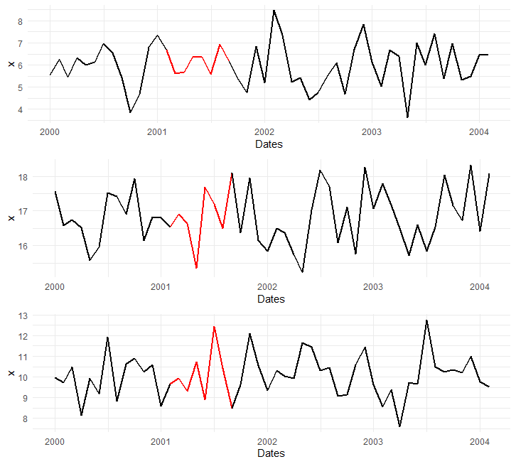
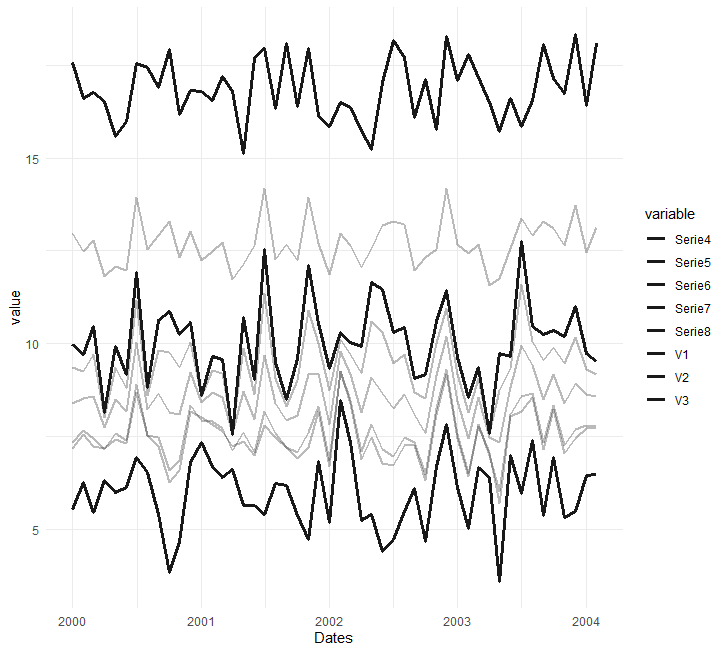
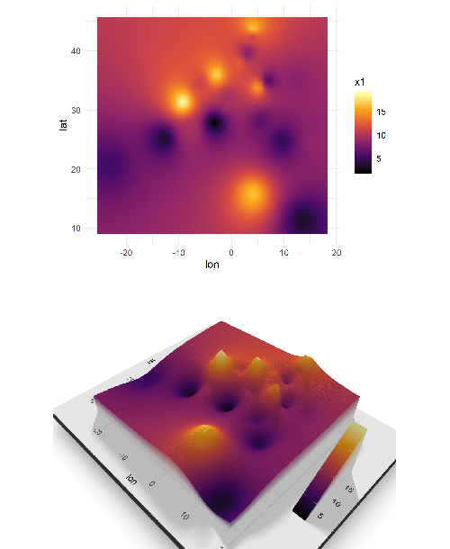
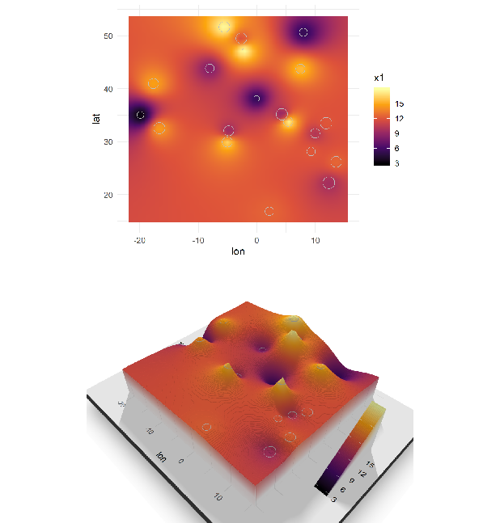
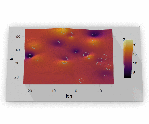

geortsBeta
==========

Beta Version of GeoRTS package. The GeoRTS package provides a set of tools for reconstruction (by interpolation) of geographical time series

Installation
----------------

Install the stable version from [CRAN](https://CRAN.R-project.org/package=GeoRTS):

``` r 
install.packages("GeoRTS")
```


or install the development version from [Github](https://github.com/InstitutoInvestigacionesEconomicasPUCE/GeoRTS):

``` r
# install.packages("devtools")
devtools::install_github("InstitutoInvestigacionesEconomicasPUCE/GeoRTS")
```

Functions
----------------

plotClean: This function generates a plot with the original and reconstructed series
plotGrupThis: function generates a plot with the original and reconstructed series









</img>

